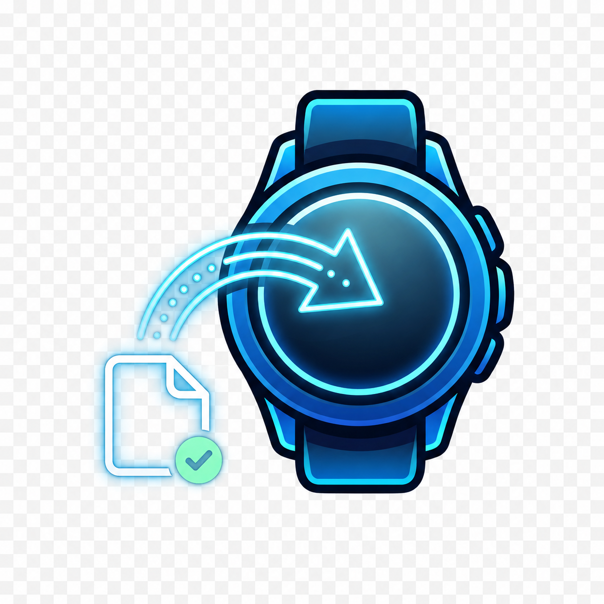

# Tizen Loader BR Desktop 🇧🇷⌚



Um aplicativo para Windows feito para facilitar a vida de quem quer instalar, analisar e remover pacotes Tizen em relógios Samsung Galaxy Watch com Tizen, sem precisar decorar comandos de terminal.

[](#)
[](#)
[](LICENSE)

## ✅ O que ele faz

- 🔎 Encontra relógios Tizen conectados via SDB.
- 📡 Conecta pelo IP do relógio na rede.
- 📦 Lê pacotes `.wgt`, `.tpk` e `.zip`.
- 🧠 Analisa informações do pacote, como nome, versão, Package ID, assinatura e SHA-256.
- 📚 Organiza os pacotes em uma biblioteca local.
- 🚀 Instala apps e watchfaces no relógio.
- 🧹 Lista e desinstala apps já instalados.
- 🩺 Mostra status do relógio, como bateria, memória, disco e tempo ligado.
- 📝 Guarda logs para ajudar a entender erros de conexão ou instalação.

## ⚠️ Antes de tudo

Este app é para **relógios Samsung com Tizen**.

Ele **não é para Wear OS**, **não usa ADB** e **não burla certificado/assinatura**. Se um pacote não for compatível com o seu relógio ou não tiver assinatura válida, a instalação pode falhar mesmo usando o app.

Use apenas pacotes que você tem direito de instalar.

## ⬇️ Como baixar o app pronto

1. Abra a página de releases:
   [github.com/TBDevMaster/Tizen-Loader-BR-Desktop/releases](https://github.com/TBDevMaster/Tizen-Loader-BR-Desktop/releases)
2. Entre na versão mais recente.
3. Em **Assets**, baixe o arquivo:
   `TizenLoaderBRDesktop-win-x64.exe`
4. Abra o arquivo baixado.

💡 Se o Windows mostrar um aviso do SmartScreen por ser um app novo, clique em **Mais informações** e depois em **Executar assim mesmo**, se você confia no download oficial deste repositório.

## 🧩 O que você precisa

- 🪟 Windows 10 ou Windows 11.
- ⌚ Um Samsung Galaxy Watch com Tizen.
- 📶 Computador e relógio na mesma rede Wi-Fi, ou conexão SDB já funcionando.
- 🛠️ Depuração/Debug ativado no relógio.
- 📦 Arquivos `.wgt`, `.tpk` ou `.zip` contendo pacotes Tizen.

O app tenta encontrar o `sdb.exe` automaticamente. Se não encontrar, você pode configurar o caminho manualmente na aba **Configurações**.

## 🚀 Como usar, passo a passo

### 1. Prepare o relógio ⌚

1. Ligue o Wi-Fi do relógio.
2. Deixe o relógio na mesma rede do computador.
3. Ative a opção de depuração/debug nas configurações de desenvolvedor do relógio.
4. Deixe a tela do relógio desbloqueada na primeira conexão, porque ele pode pedir confirmação.

### 2. Abra o app 🖥️

1. Abra `TizenLoaderBRDesktop-win-x64.exe`.
2. Vá em **Configurações** e confira se o caminho do `sdb.exe` foi detectado.
3. Se precisar, clique em salvar depois de ajustar as pastas.

### 3. Conecte o relógio 📡

Na aba **Dispositivos**, você pode usar dois caminhos:

- Clique em **Buscar rede** para o app procurar o relógio automaticamente.
- Ou digite o IP do relógio no campo de conexão e clique em **Conectar IP**.

Depois disso, clique em **Atualizar**. Se tudo estiver certo, o relógio aparece na lista.

### 4. Coloque os pacotes na biblioteca 📚

1. Vá em **Configurações**.
2. Escolha a **Pasta de downloads** onde ficam seus `.wgt`, `.tpk` ou `.zip`.
3. Coloque os arquivos nessa pasta.
4. Vá em **Biblioteca**.
5. Clique em **Atualizar**.

O app vai procurar pacotes, analisar os arquivos e mostrar os itens encontrados.

### 5. Instale no relógio 🚀

1. Selecione o relógio em **Dispositivos**.
2. Vá em **Biblioteca**.
3. Selecione o pacote desejado.
4. Clique em **Instalar**.
5. Acompanhe o resultado no log de instalação.

Se o app avisar que não encontrou assinatura, isso significa que o pacote pode falhar por certificado. Você pode tentar mesmo assim, mas não há garantia.

### 6. Remova um app instalado 🧹

1. Vá em **Dispositivos**.
2. Clique em **Listar apps**.
3. Selecione o app instalado.
4. Clique em **Desinstalar**.

## 🧭 Abas do aplicativo

- **Dispositivos**: conexão com o relógio, lista de apps instalados, desinstalação e status do dispositivo.
- **Biblioteca**: pacotes encontrados, análise, instalação e exclusão da biblioteca.
- **Fontes**: link para fonte comunitária aberta no navegador.
- **Diagnóstico**: logs e comandos úteis para entender problemas.
- **Configurações**: caminho do `sdb.exe` e pasta de downloads.
- **Créditos**: informações do projeto e apoio ao desenvolvedor.

## 🆘 Problemas comuns

**O relógio não aparece**

- Confira se o relógio e o PC estão na mesma rede.
- Confirme se o debug/depuração está ativado.
- Deixe a tela do relógio ligada e desbloqueada.
- Tente informar o IP manualmente.
- Clique em **Buscar rede** novamente.

**A instalação falhou**

- O pacote pode não estar assinado corretamente.
- O pacote pode ser de outro modelo ou versão de Tizen.
- O relógio pode ter recusado a instalação por certificado.
- Veja a aba **Diagnóstico** e o log de instalação.

**O Windows bloqueou o app**

- Isso pode acontecer porque o executável ainda não tem assinatura de publicador.
- Baixe sempre pela página oficial de releases deste repositório.

## 📁 Onde ficam os dados do app

Configurações, biblioteca e logs ficam nesta pasta do Windows:

```text
%LocalAppData%\TizenLoaderBRDesktop
```

## 👨‍💻 Para desenvolvedores

Para compilar:

```powershell
dotnet build .\TizenLoaderBRDesktop.sln -c Release
```

Para gerar uma publicação Windows x64:

```powershell
dotnet publish .\TizenLoaderBRDesktop\TizenLoaderBRDesktop.csproj -c Release -r win-x64 --self-contained true -p:PublishSingleFile=true -p:IncludeAllContentForSelfExtract=true -p:EnableCompressionInSingleFile=true -o .\artifacts\publish\win-x64
```

## 📜 Licença

Este projeto está sob a licença **MIT**. Veja o arquivo [LICENSE](LICENSE).

Componentes e ferramentas de terceiros, como SDB/Tizen e bibliotecas NuGet usadas pelo projeto, pertencem aos seus respectivos autores e podem ter suas próprias licenças.

## 💙 Comunidade

Desenvolvido por **TB DEV** para a comunidade Tizen BR.

Se o app te ajudou, considere apoiar o projeto pela aba **Créditos** dentro do aplicativo.
